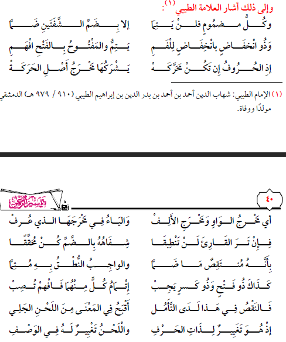

# ملخص 15/3/2021
## كيفية حدوث الصوت
** الصوت **: اهتوزاز واختلال في الهواء تدركه
** أسباب الصوت **: الاصطدام والاعتزاز والتباعد وغيرها
### حروف المد واللين
الألف بانفتاح الفكين، والووا بضم الشفتين، والياء بخفض الفك السفلي
### الحروف المتحركة: تشترك مع مخرج أصل الحركة حين النطق
وإتمام الحركة واجب في التلاوة لأن الانتقاص منه انتقاص من ذات الحرف
